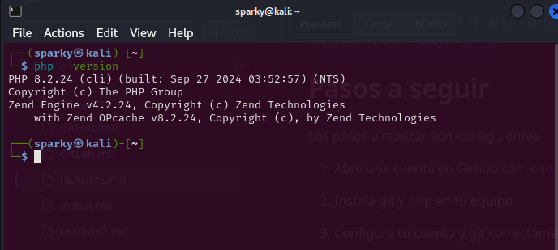

Lo primero que vamos a comprobar es si tenemos instalado php y qué versión se encuentra instalada en nuestro equipo. Para ello ejecutamos por consola el siguiente comando: `php --version` obtendremos una salida como esta:

 

Como se puede comprobar php se encuentra en su versión más reciente.
Si por cualquier circunstancia hubiera que actualizar o instalar una nueva versión, ejecutaríamos el siguiente comando por consola:

`sudo apt-get update`
`sudo apt-get upgrade`
`sudo apt install php8.2.24` (O bien la versión que corresponda)

Para instalar git utilizamos la consola con el comando de linux:

`sudo apt-get install git`

Tras la isntalación de git hemos generado un par de claves para poder usarlas luego mas tarde por ssh al servidor de github.

`ssh-keygen -t ed25519 -C "usuario@dominio.com"`
cambiar usurio y dominio por el que corresponda en cada caso.

Tras la generación de claves ha de configurarse el archivo "config" de ssh en git para poder conectar los archivos locales con nuestra cuenta a github.

En identityFile especificaremos la ruta al archivo de claves que hemos creado anteriormente.
Con esta configuración hemos terminado la instalación de git.
Ahora tendremos que vincular nuestro git con la cuenta de github.
Para ello es necesario contar con una cuenta en github.

